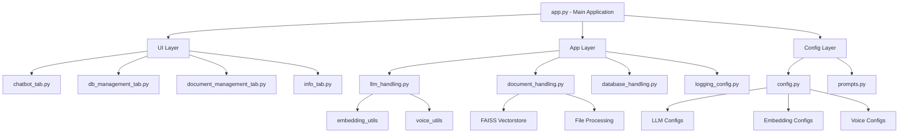

# Struttura dell'Applicazione EduRag Beta

## Diagramma dell'Architettura


## Componenti Principali

### 1. UI Layer
- chatbot_tab.py: Interfaccia principale del chatbot
- db_management_tab.py: Gestione database
- document_management_tab.py: Gestione documenti
- info_tab.py: Informazioni sul sistema

### 2. App Layer
- llm_handling.py: Gestione LLM e embeddings
- document_handling.py: Processamento documenti
- database_handling.py: Gestione database FAISS
- logging_config.py: Configurazione logging

### 3. Config Layer
- config.py: Configurazioni generali
- prompts.py: Template dei prompt

### 4. Utilities
- embedding_utils: Gestione embeddings
- voice_utils: Generazione audio

### 5. Storage
- FAISS Vectorstore
- File system per documenti
- Metadata in JSON

## Caratteristiche Principali
- Struttura modulare
- Separazione delle responsabilità
- Facile manutenzione
- Scalabilità del sistema
- Gestione efficiente delle dipendenze
```